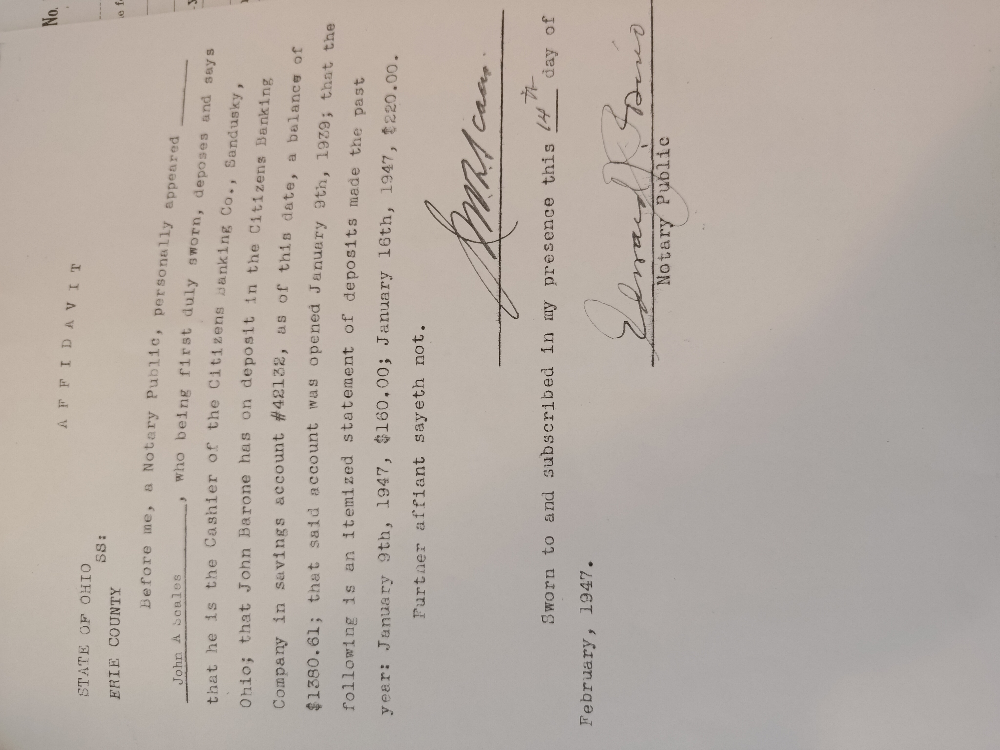

Prior to arriving in the US, Joe and Georgia's Children applied for a Visa for them. 
To do so, they needed quite a bit of info.

## Affidavits
### John Barone, Joe's Son - Feb. 13, 1947

### Salvatore Barone, Joe's Son - Feb. 13, 1947

### John Scales, Cashier of Citizen's Banking Co. - Feb. 14, 1947

## Birth and Marriage Certificates
[Certificates](certificates.md)

# Application
With all the above info, the law office was able to submit a 'Petition of Issuance of Immigration Visa'.  This document, if approved, assures that Joe will be able to get a visa on arrival to the states.

## Law Office Letter - Mar. 10, 1947

## Petition of Issuance of Immigration Visa - Mar. 17, 1947

# Approval
A few days later, it was approved!

## Examiners Worksheet - Mar. 20, 1947

## Approval - Mar. 26, 1947

# Application
In May of the following year, Joe filled out an actual visa Application.
## Visa Application - May. 22, 1948

# Arrival
And finally, he arrived in the US on Sept. 23, 1948 and received his visa.
## Arrival Certificate - Sept. 23, 1948
### This document was requested in 1951 as part of the Naturalization paperwork.  More in [Road to Citizenship](road_to_citizenship.md)

### You can see that the boat they arrived on was called the 'SS Marine Perch'.  Here is an image of the boat found online. (not NARA provided)

### Here is another publicly available image of a passenger manifest for the Marine Perch. (not NARA provide) - Sept. 23, 1948   See Passengers 15 and 16:

## Visa - Sept. 23, 1948

See the next chapter of this story here: [Road to Citizenship](road_to_citizenship.md)