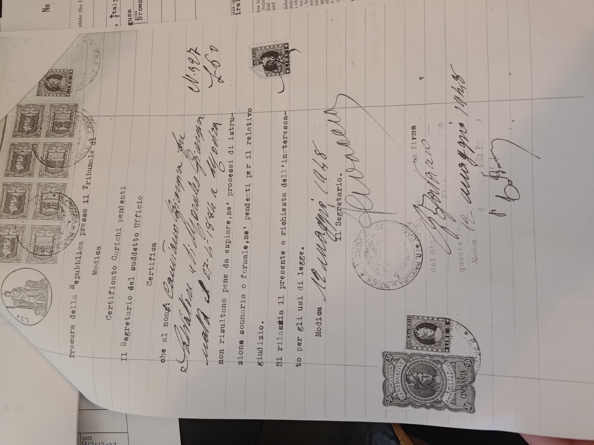

## The following documents were all requested in 1948 for Joe's application for a Visa.

### Joe's Birth Certificate - Feb. 11, 1881

### Giorgia's Birth Certificate - April 27, 1884

### Joe and Giorgia Marriage Certificate - March 26, 1905

### Family Chart - July 12, 1948

### Giorgia Background Check - 1948

### Modica Seal of Authenticity - March 15, 1948

