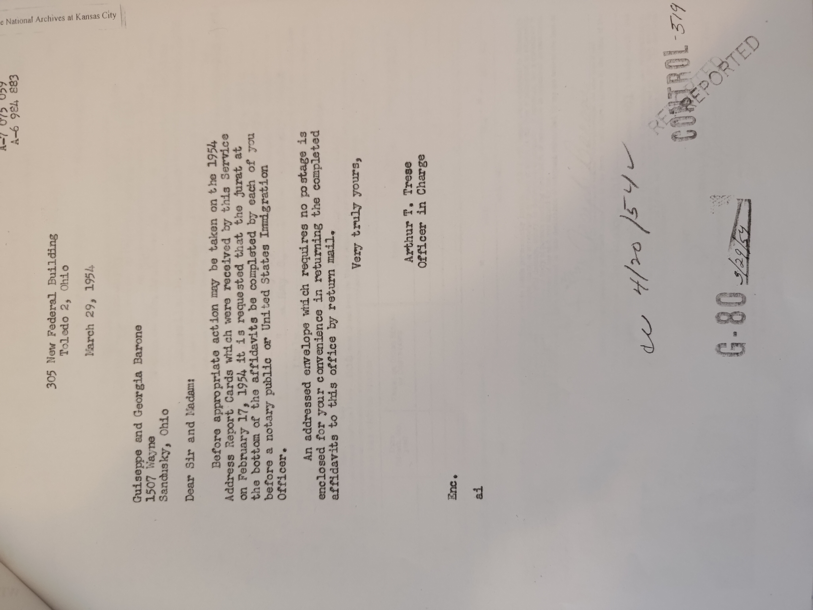
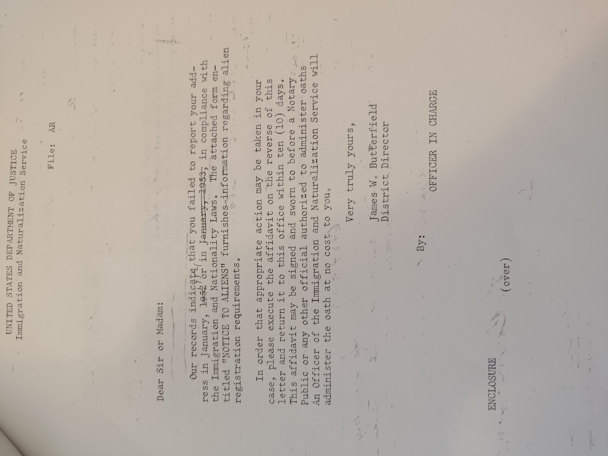
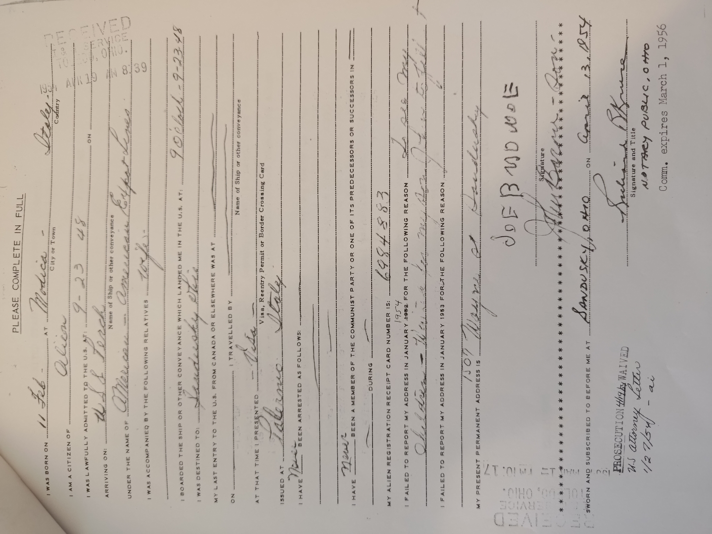
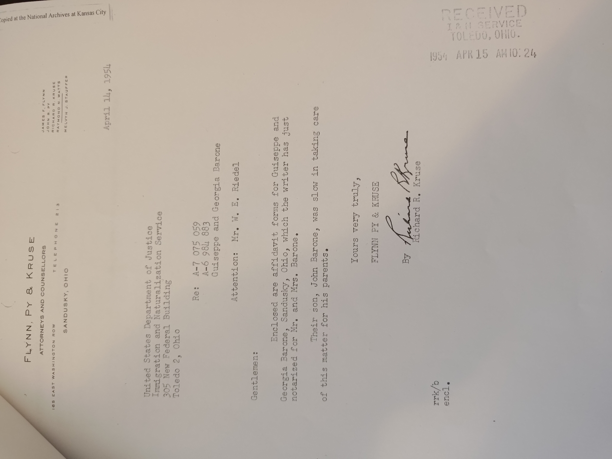
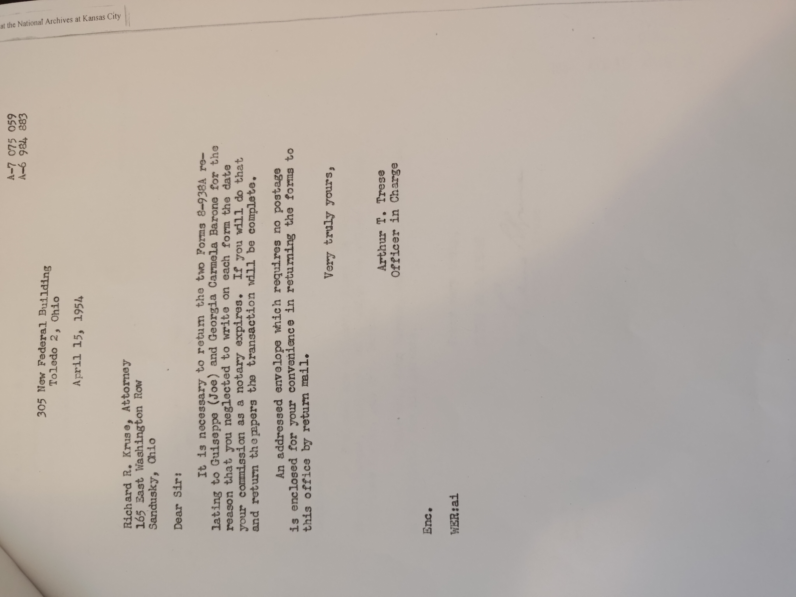

# Oops!

In March of 1954, John forgot to report Joe's address to the government. (John handled all of Joes paperwork)

## USDJ Letter - March 29, 1954

## John didn't respond, so they asked again - April 13, 1954

## They finally filled in the Affadavit - April 13, 1954

## A Notary sent it over the next day with a letter - April 14, 1954

## And then got a note back from a picky person at the USDJ - April 15, 1954
