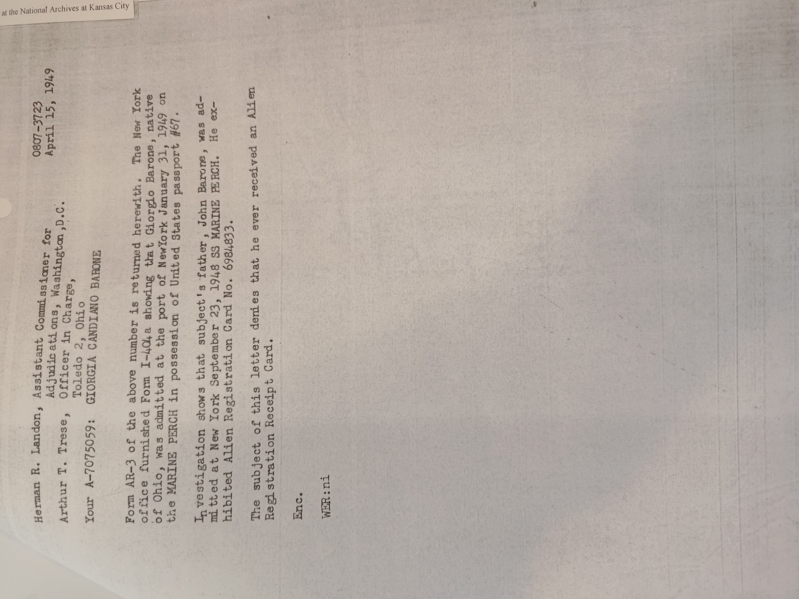
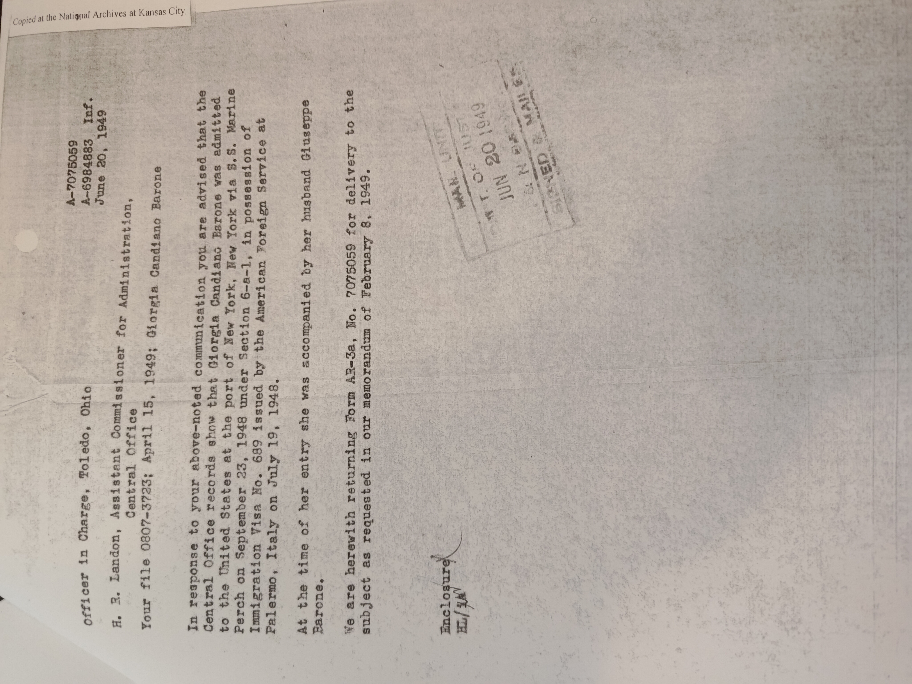
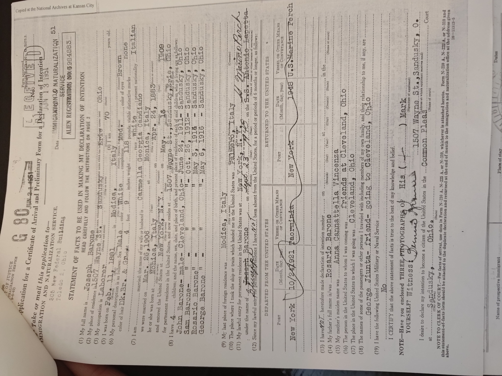
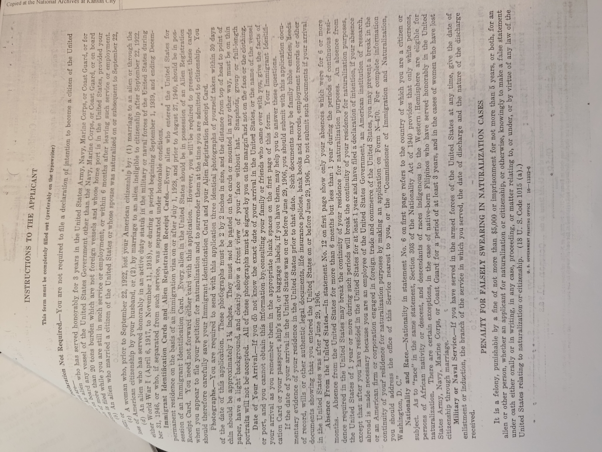
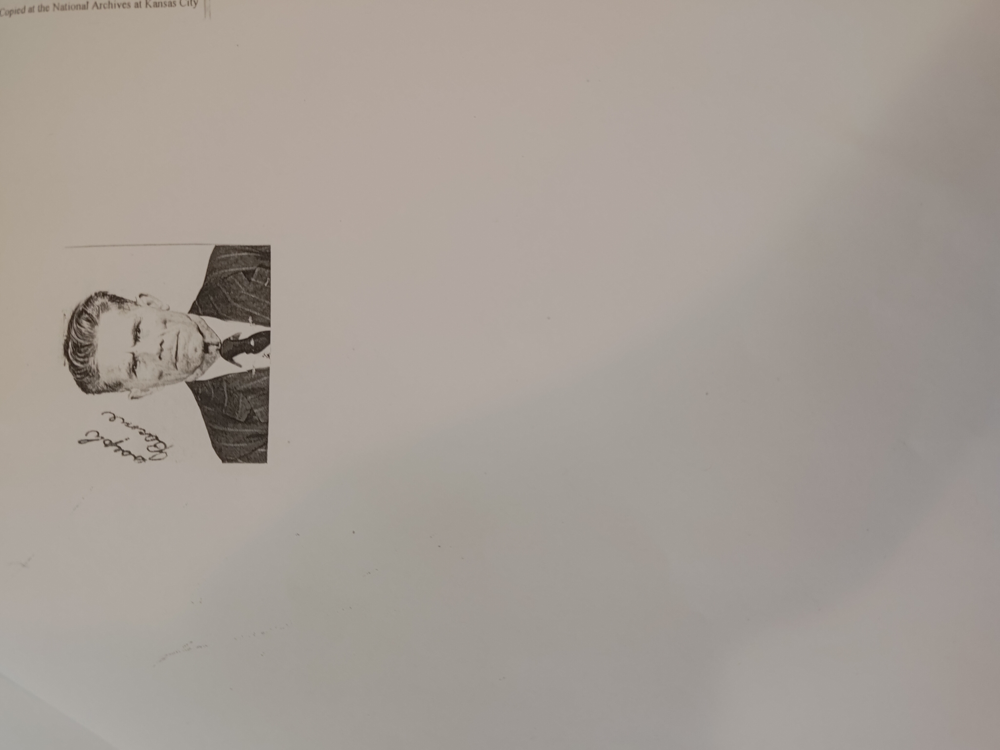
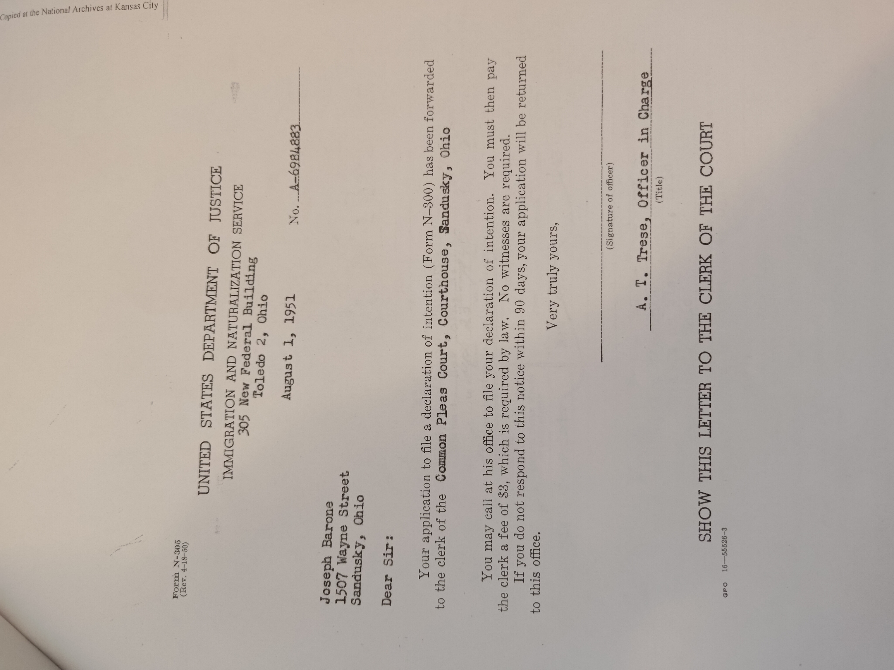
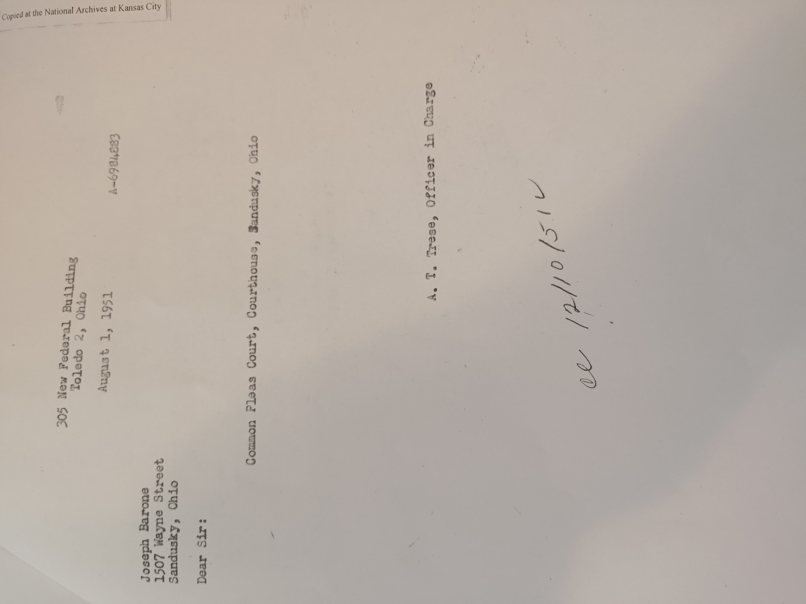
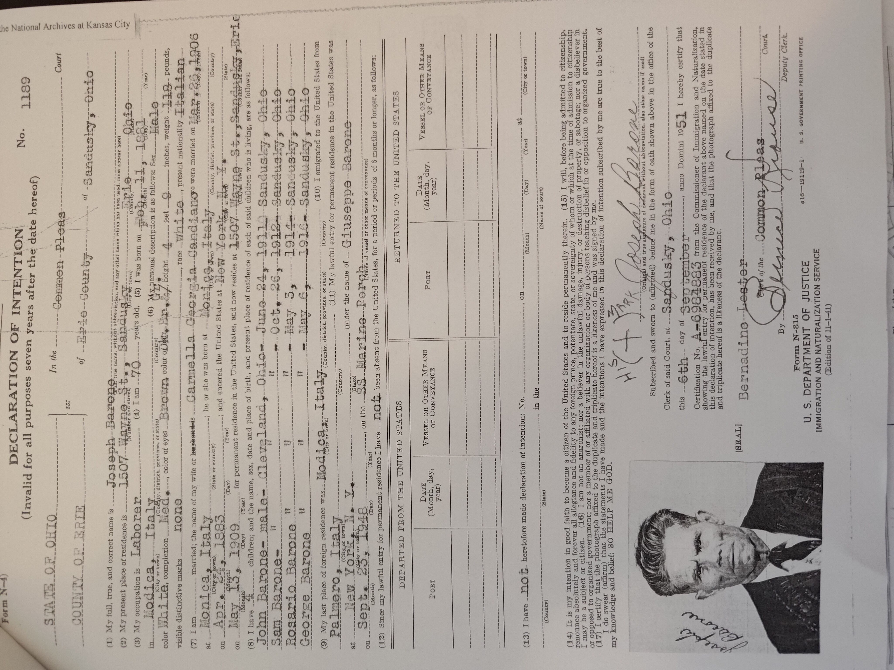

# Documents on Joe's process for becoming a US citizen

## Getting a Certificate of Arrival
The certificate of arrival is government proof that one arrived on a certain date.
### Some letters to/from the USDJ 
#### Letter 1 - April 15, 1949

#### Letter 2 - June 20, 1949

### Then, an Application for it - June 13, 1951

### The Certificate of Arrival - July, 26 1951

## After all that, The Declaration of Intent
### Letters - August 1, 1951

### The actual Declaration - Sept. 6, 1951

A declaration of intent is where this trail ends.  We can assume he naturalized based on that we know he was a US Citizen.  From here, we can contact the Erie county court for his naturalization records.  It is likely that he was not given citizenship for many years after this.

A few years later, a little incident happened.  Read about it here: [Oops](failure_to_report.md)