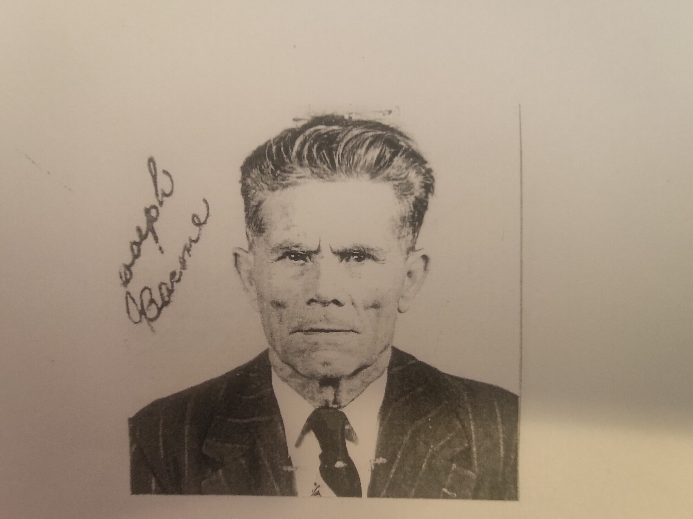
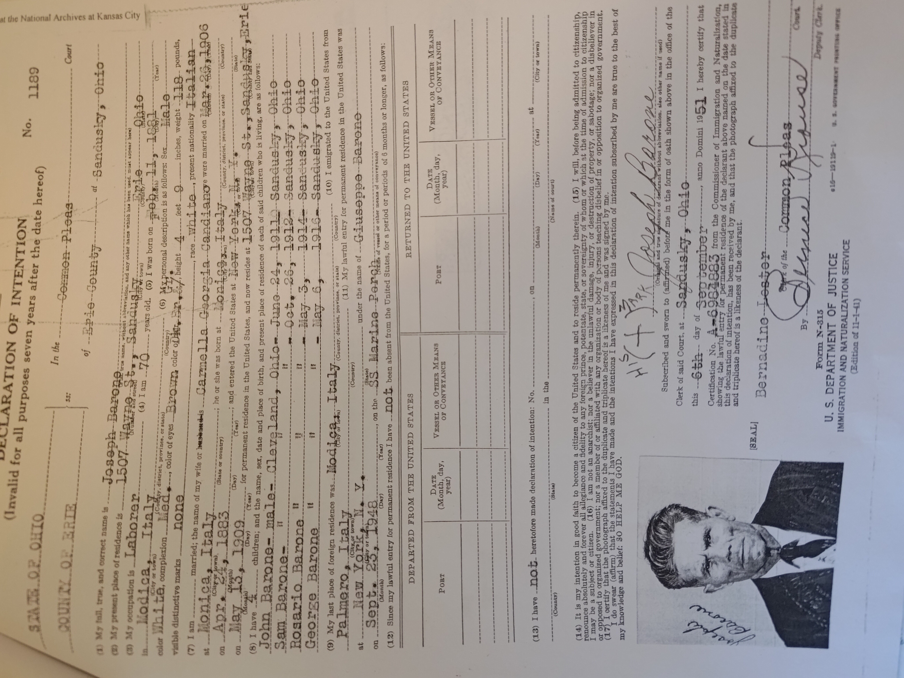

# Barone Italian Citizenship
- [Barone Italian Citizenship](#barone-italian-citizenship)
  - [Overviewss](#overviewss)
  - [What Does Citizenship Mean](#what-does-citizenship-mean)
  - [The Process](#the-process)
    - [Finding a Relative](#finding-a-relative)
    - [Proving Relation](#proving-relation)
  - [What Are My Next Steps?](#what-are-my-next-steps)
    - [Acquire Documents](#acquire-documents)
      - [Naturalization](#naturalization)
      - [Birth, Death, and Marriage Certificates](#birth-death-and-marriage-certificates)
        - [A Few Possible Shortcuts](#a-few-possible-shortcuts)
    - [Meeting With the Consulate](#meeting-with-the-consulate)
      - [Location](#location)
      - [Scheduling](#scheduling)
      - [Meeting](#meeting)
  - [Specific Checklists](#specific-checklists)
    - [Travis and Hannah](#travis-and-hannah)
    - [Ryan](#ryan)
    - [Anyone else](#anyone-else)

## Overviewss
Italian Citizenship is based on a simple pass from parent to child.  This means that an Italian Citizen can pass citizenship onto children regardless of:
- Where the parent is born
- Where the child is born
- If either ever lived in Italy.
- If the child's birth was registered in Italy

Because of this, a relative with Italian Citizenship can pass it down the line to any children, indefinitely.

## What Does Citizenship Mean
Going through this process will result in the Italian Government recognizing you as an Italian Citizen.  More specifically, you will be a Dual United States / Italian Citizen. 

This means:
- You can freely live in Italy.
- You can freely work in Italy.
- You can apply for a European Union Passport, allowing you to freely travel between all EU Territories.

You can also pass your citizenship on to any children you might have, giving them the same freedoms from above.

You can also pass on you citizenship to your spouse, but there are a few more hurdles for them.  Most notably, they must learn to speak Italian and pass an Italian Fluency test.

## The Process
To inherit citizenship, one must 
- Find a relative that:
    - Was an Italian citizen
    - Was able to pass citizenship to their children, but didn't. 
- Prove that:
    - Your relative was in fact an Italian citizen when they had children   
    - Anyone between said relative and oneself are direct descendants
    - Oneself is a child of your parent

### Finding a Relative 
After YEARS of research, this is now done!  Meet, Guiseppe (Joe) Barone!

- Guiseppe was born in 1881 in Modica Italy, making him an Italian Citizen.  
- His parents were both Italian Citizens, so there is no question he was one also.
- He had 4 children, John, Sam, Rosario, and George.  The latest of which was born in 1916.

To assure that Joe could pass his citizenship on to his children, we needed to verify that he did not denounce his Italian Citizenship (Nationalize - Becoming a US Citizen) prior to having his children.  This information is hard to be sure of, as public records of Naturalization are not readily available.  This is especially difficult with Joe, as he came to the US in the early 1900's, then went back to Italy, and finally came back to the US.  During any of these moves, he could have denounced either citizenship, and muddied the water on his eligibility.

Ultimately, to know for sure we had to place a request with the National Archives and Records Association to find all the paperwork they had on Joe (this paperwork is called an 'A-File' or 'Alien File').  That process took over a year!  But, we can now be absolutely certain that Joe didn't nationalize until 1951, long after having his son Sam.   

This is a Declaration of Intention, paperwork filed by Joe to gain US citizenship.  This is not the actual Naturalization Certificate.

### Proving Relation
We have a relative, but now we need to prove to Italian Government that we are related. To do this, we need to have Birth, Marriage, and Death Certificates for all relatives between.  In my case (Travis Zimmerman) for example, I need Sam Barone, Carole Zimmerman, Barrett Zimmerman, and My Birth, Marriage, and Death (where applicable) Certificates.

All of these documents need to be:
- A Certified Copy, a type of copy you can request from the government.
- Have an accompanying Apostille.
- Translated into Italian by a professional translator.

## What Are My Next Steps?
- Acquire documents.
    - Naturalization
    - Birth, Death, and Marriage Certificates for all between, including spouses.
- Meet with The Italian Consulate of your area.
    - Location
    - Scheduling
    - Meeting

### Acquire Documents
#### Naturalization
Joe must be a registered Italian Citizen with the Consulate of your area.

[Consolute Locations](https://www.italiandualcitizenship.net/italian-consulate-locations/)

In brief, Naturalization documentation only needs to be provided to the consolute for the first person to apply.  Once done, Joe will be registered with that consulate and that one only.  All subsequent people will only need to prove relation to Joe.

For all of us living in Ohio, we will go to the Detroit Consulate.  We only need to get 1 copy of the Naturalization Document.  
Others, Ryan for example, will need to get their own document and go to the Consulate of DC (or other).

Getting this document is still a bit of a mystery, but we are now one step closer. In the documents from NARA, we now know that Joe made his Declaration of Intention with Erie County.  We will be reaching out to Erie County this week to try and get that document.  (Documents can be with NARA, The county, or another place with the Federal Government. We didn't receive them from NARA, so we are hopeful the county has them.)

Hold on this step for more information from Travis and Hannah

#### Birth, Death, and Marriage Certificates
You must prove you are a descendant of Joe, however there is a shortcut for those in the same consulate. (Sorry Ryan, no shortcuts for you.)

To do so, we must get and present Certified Copies of all Birth, Death, and Marriage Certificates for everyone between Joe and Us, including spouses.  On top of that, these documents must be translated to Italian and have an accompanying apostille.

A Certified Copy is something you can submit a written request for with the government.  In this request, you can specify a quantity. 

In short, we need a bunch of documents:

- Joe and Giorgia:
    - Birth      - From Italy, may be hart to get
    - Marriage   - From Italy, may be hard to get
    - Death      - State of Ohio for Joe, and Erie County for Giorgia.  (records went from county to state in 1973)

- Sam and Anne:
    - Birth     - State of Ohio
    - Marriage  - County of Marriage Probate Court  (Erie County?)
    - Death     - Erie County Health Department for Sam, State of Ohio for Anne

- Carole / Tony / Sam / Joe  (and spouse)
    - Birth     - State of Ohio
    - Marriage  - County of Marriage Probate Court
    - Death     - State of Ohio (where applicable)

- Continue down the line to You, INCLUDING YOURSELF. Birth and Death certificates will be with the State of Ohio, Marriage at the county level.

Since we can request multiple copies, we will request a few sets for Sam and Joe.  Allowing Ryan in the DC area to get those copies without needing to duplicate the document request.

##### A Few Possible Shortcuts

After one person takes all of this info to the consulate, everyone else only needs to prove up then line.  For example, if Travis goes and gets citizenship, Alec Zimmerman would only need to have documentation back to Mark.  They will be able to dig up the records from Carole back.

If Carole wanted citizenship, she could go through this process first.  Then, everyone else only needs to prove relation to Carole.

### Meeting With the Consulate
#### Location
Your Consulate location is based on where you live.

[Consolute Locations](https://www.italiandualcitizenship.net/italian-consulate-locations/)

#### Scheduling
Check your consulate for scheduling.  For Detroit, we are currently out 2 years in scheduling appointments.

#### Meeting
Take all the above documents to the meeting.

## Specific Checklists

### Travis and Hannah
- [ ]  Schedule a Meeting with the Detroit Italian Consulate. (2 years out)
- [ ]  Get Naturalization Documents for Joe
- [ ]  Get Birth, Death, and Marriage Docs for Joe, Sam, and Spouse
- [ ]  All the other Travis and Hannah Specific Tasks

### Ryan
- [ ] Schedule a Meeting with the DC Italian Consulate. 
- [ ] Get Certified Copies of Birth, Death, and Marriage certificates for Tony, Ryan, and Spouses.
    - [ ]  If you can, request an Apostille at the same time.  If not, get one for each document.
- [ ] Have the documents translated to Italian.  Consulates sometimes have recommendations for who to have do this process.

### Anyone else
- [ ] Let Travis and Hannah know you are interested and we can advise.